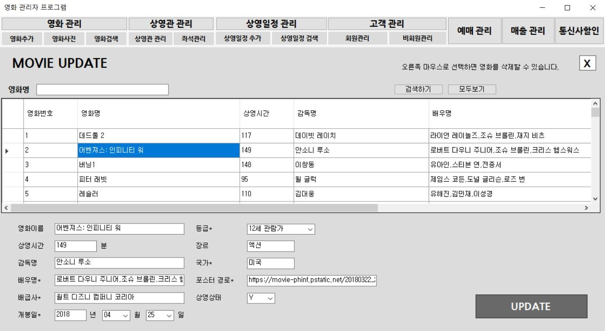
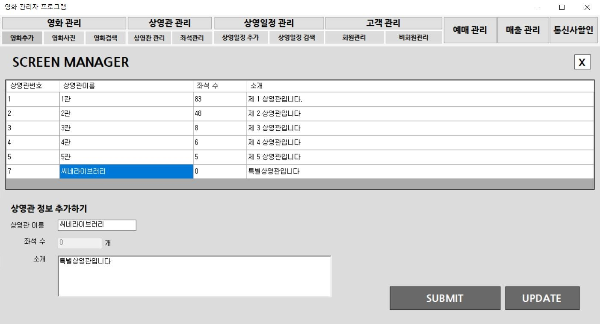
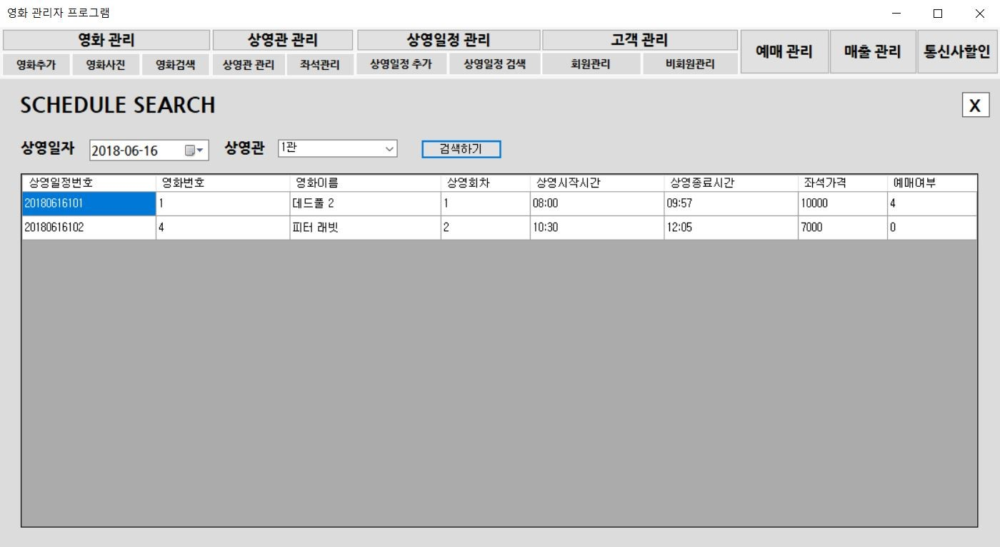

# 영화 예매 관리자 프로그램

# 프로그램 개요

# 목차
- 영화 예매 사용자 프로그램 주소
- 개발환경
- DB ERDiagram
- 주요기능 및 동작 화면

# 영화 예매 사용자 프로그램 주소
https://github.com/shkim52/db_cinema

# 개발환경
- 개발 언어 : C# .Net Framework
- 개발 환경 : visual Studio 2013
- 데이터베이스 : AWS RDS Oracle 11g
- 버전관리 : Git

# DB ERDiagram
</img>

# 주요기능 및 동작 화면
## 영화정보 관리
</img>
## 영화사진 입력
</img>
## 영화정보 검색 및 수정
</img>
## 상영관 정보 입력 및 수정
</img>
## 좌석정보 입력 및 수정
</img>
## 상영일정 입력
</img>
## 상영일정 검색 및 삭제
</img>
## 고객정보 확인 및 강제탈퇴
</img>
## 예매정보 검색 및 예매취소
</img>
## 영화별 누적 관객 수 조회
</img>
## 연령별 영화선호도 조회
</img>
## 월별 매출 조회
</img>
